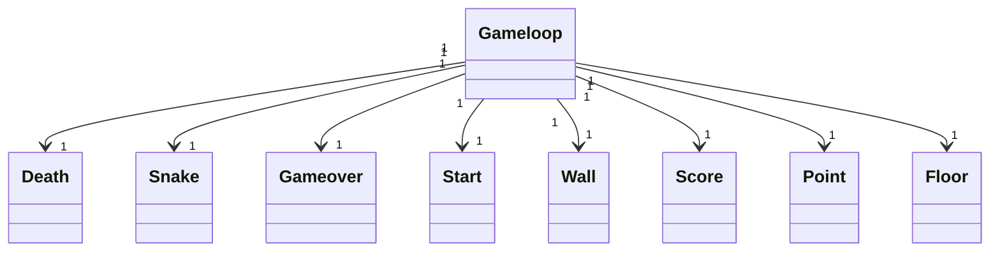
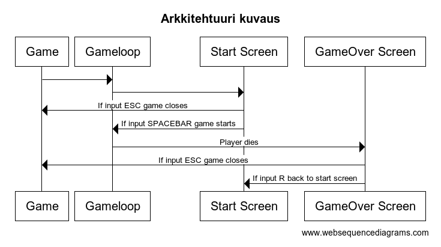

# Rakenne

Pakkaus rakenne on:

# Luokka kaavio

```mermaid
 classDiagram
     Gameloop "1" --> "1" Death
     Gameloop "1" --> "1" Snake
     Gameloop "1" --> "1" Gameover
     Gameloop "1" --> "1" Start
     Gameloop "1" --> "1" Wall
     Gameloop "1" --> "1" Score
     Gameloop "1" --> "1" Point
     Gameloop "1" --> "1" Floor
      class Gameloop{
      }
      class Death{
      }
      class Snake{
      }
      class Gameover{
      }
      class Start{
      }
      class Wall{
      }
      class Score{
      }
      class Point{
      }
      class Floor{
      }
```

# Toiminnallisuus kaavio

