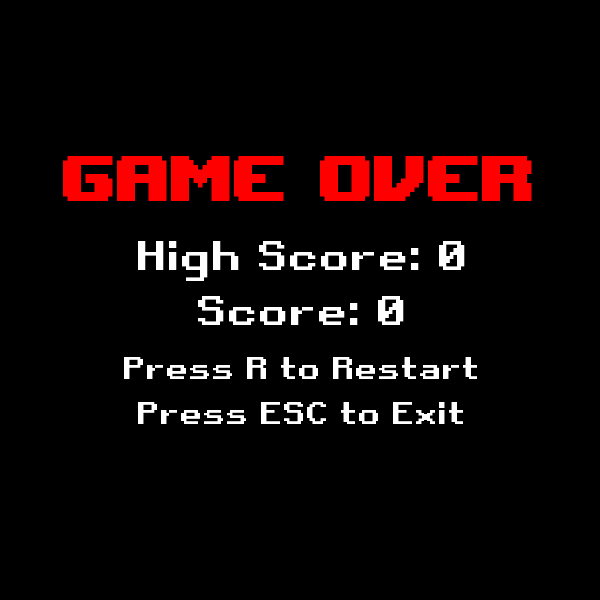

# Käyttöohje

Lataa projektin viimeisimmän [releasen](https://github.com/Kilpikonna02/ot-harjoitustyo/releases) lähdekoodi klikkaamalla linkkiä.

## Ohjelman käynnistäminen

Ennen ohjelman käynnistämistä, asenna riippuvuudet komennolla:

```bash
poetry install
```

Nyt ohjelman voi käynnistää sen jälkeen komennolla:

```
poetry run invoke start
```

## Pelin aloittaminen

Sovellus käynnistyy aloitys näyttöön:


Pelin voi aloittaa painamalla näppäimistösä __SPACE__ eli välilyönti näppäintä painamalla.

Madon väriä voi myös muoka painamalla __C__ näppäintä.

Pelin sammutus taas onnistuu painamalla __ESC__ näppäintä.

## Pelin loputtua

Kun pelaaja häviää pelin joutuu hän lopetus näyttöön:



Tässä pelaaja näkee pelin ainaka saaneensa pisteet ja oman ennätys tuloksensa.

Pelaaja voi myös siirtyä tästä näytöstä takaisin aloitus näyttöön painamalla __R__ näppäintä.

Pelin sammutus onnistuu myös tässä painamalla __ESC__ näppäintä.
