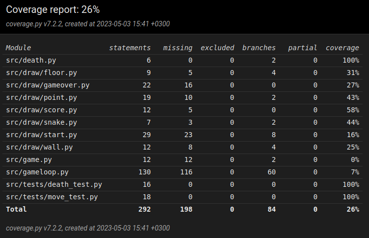

# Testausdokumentti

Ohjelmaa on testattu automatisoiduilla testeillä ja manuaalisesti.

Suurin osa testauksesta on tehty manuualiesti, koska suurin osa ohjelman funtiosta perustuu jonkin asian piirtämiseen uudelleen ja uudelleen näytölle enkä keksinyt miten sitä voitaisiin testata automaattisesti.

### Testikattavuus

Edellämainituista syistä ohjelmalle ei ole paljoa automatisoituja testejä joten, testikattavuus on vain 26%.

