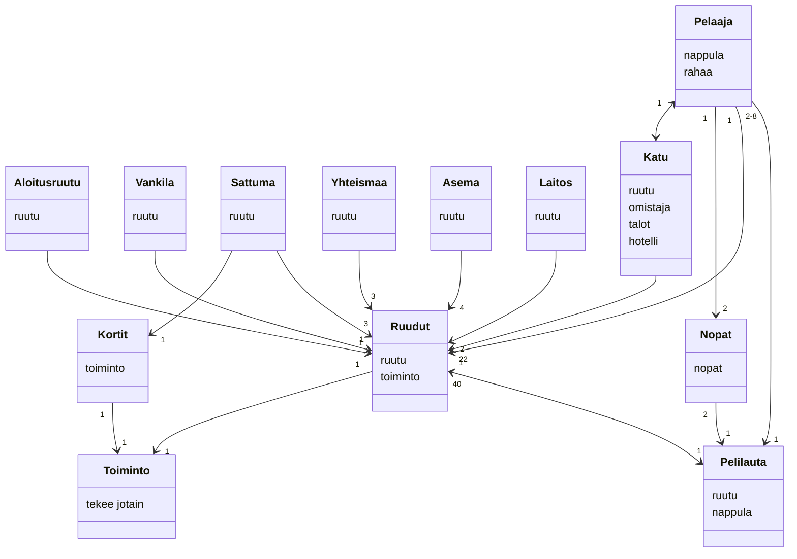

## Sovelluslogiikka

Monopoli

```mermaid
 classDiagram
      Pelaaja "2-8" --> "1" Pelilauta
      Ruudut "40" <--> "1" Pelilauta
      Pelaaja "1" --> "1" Ruudut
      Pelaaja "1" --> "2" Nopat
      Nopat "2" --> "1" Pelilauta
      Aloitusruutu --> "1" Ruudut
      Vankila --> "1" Ruudut
      Sattuma --> "3" Ruudut
      Yhteismaa --> "3" Ruudut
      Asema --> "4" Ruudut
      Laitos --> "2" Ruudut
      Katu --> "22" Ruudut
      Ruudut "1" --> "1" Toiminto
      Sattuma --> "1" Kortit
      Kortit "1" --> "1" Toiminto
      Pelaaja "1" <--> Katu
      class Pelaaja{
          nappula
          rahaa
      }
      class Pelilauta{
          ruutu
          nappula
      }
      class Ruudut{
          ruutu
          toiminto
      }
      class Nopat{
          nopat
      }
      class Aloitusruutu{
          ruutu
      }
      class Vankila{
          ruutu
      }
      class Sattuma{
          ruutu
      }
      class Yhteismaa{
          ruutu
      }
      class Asema{
          ruutu
      }
      class Laitos{
          ruutu
      }
      class Katu{
          ruutu
          omistaja
          talot
          hotelli
      }
      class Toiminto{
          tekee jotain
      }
      class Kortit{
          toiminto
      }
```
