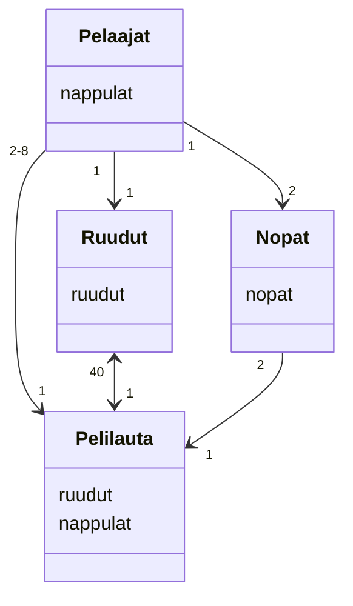

## Sovelluslogiikka

Monopoli

```mermaid
 classDiagram
      Pelaajat "2-8" --> "1" Pelilauta
      Ruudut "40" <--> "1" Pelilauta
      Pelaajat "1" --> "1" Ruudut
      Pelaajat "1" --> "2" Nopat
      Nopat "2" --> "1" Pelilauta
      class Pelaajat{
          nappulat
      }
      class Pelilauta{
          ruudut
          nappulat
      }
      class Ruudut{
          ruudut
          }
      class Nopat{
          nopat
          }
```
